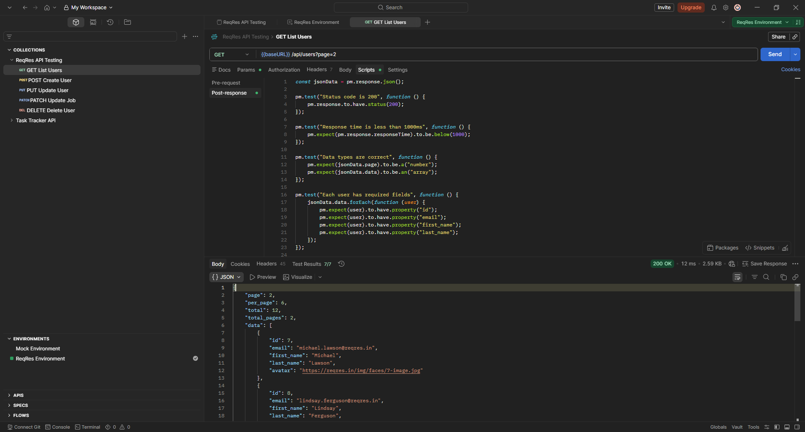
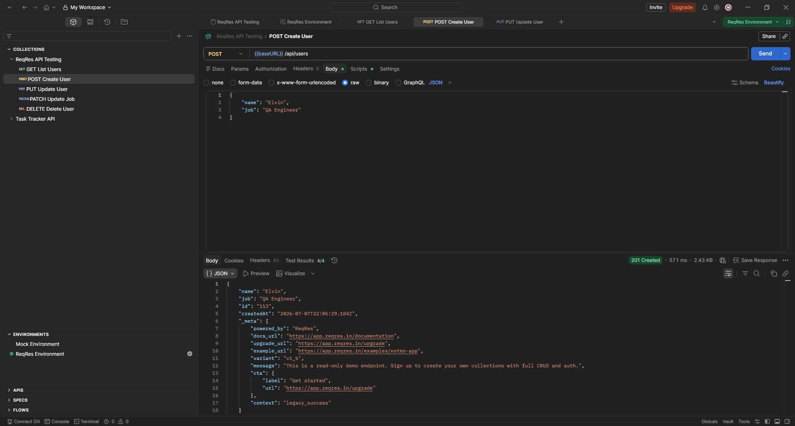
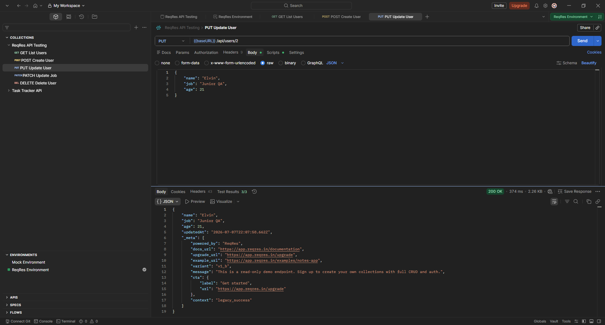
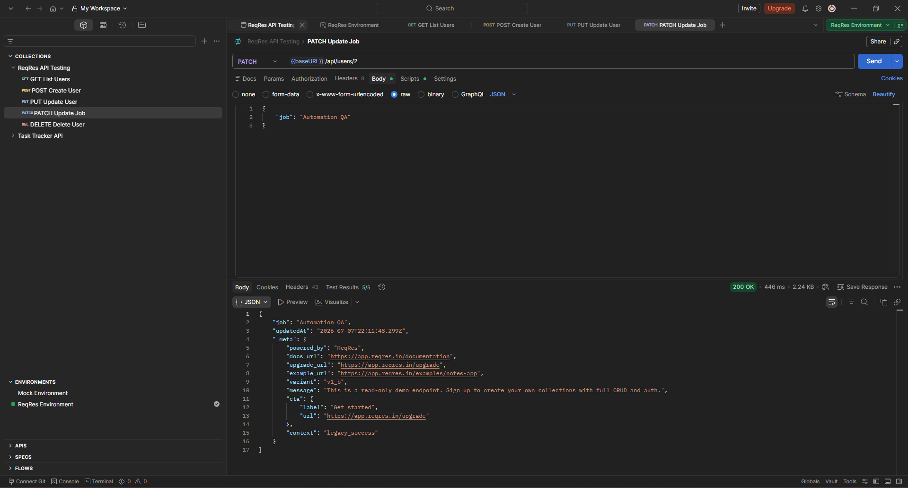
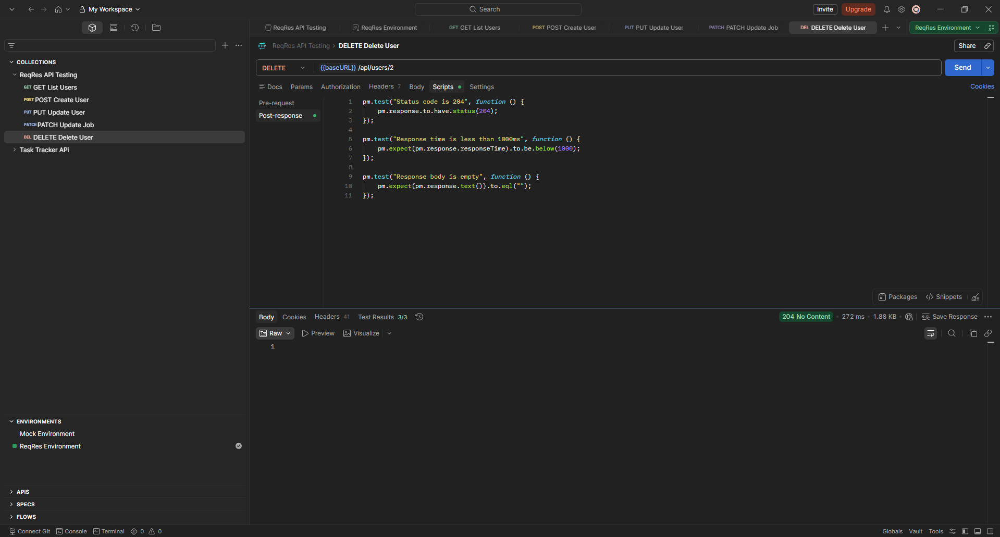

# ReqRes API Testing (Postman)

This project demonstrates API testing using Postman with the ReqRes API, covering CRUD operations, environment variables, pre-request scripts, and automated test validations.

## API

This project uses the **ReqRes** REST API for testing.

Website: https://reqres.in/

> ⚠️ As of 2026, ReqRes requires an `x-api-key` header for all requests.
> Sign up for a free key at https://reqres.in/signup

## Technologies

- Postman
- REST API
- JSON
- JavaScript (Postman Tests)

## Features

- Environment Variables
- Pre-request Script
- Post-response Script
- Automated API Tests

## Requests

|    Method  |       Endpoint      |     Description     |
|------------|---------------------|---------------------|
| ✅ GET    | `/api/users?page=2` | List Users          |
| ✅ POST   |    `/api/users`     | Create User         |
| ✅ PUT    |  `/api/users/{id}`  | Full Update User    |
| ✅ PATCH  |  `/api/users/{id}`  | Partial Update User |
| ✅ DELETE |  `/api/users/{id}`  | Delete User         |

## Environment Variables

|  Variable |     Description     |
|-----------|---------------------|
| `baseUrl` | `https://reqres.in` |
|  `apiKey` | Your ReqRes API key |

## Pre-request Script

Automatically adds the API key header to every request:

```javascript
pm.request.headers.add({
    key: "x-api-key",
    value: pm.environment.get("apiKey")
});
```
## Post-response Scripts (Tests)

> Each request has its own tests written in the **Tests** tab in Postman.

### GET - List Users

```javascript
const jsonData = pm.response.json();

pm.test("Status code is 200", function () {
    pm.response.to.have.status(200);
});

pm.test("Response time is less than 1000ms", function () {
    pm.expect(pm.response.responseTime).to.be.below(1000);
});

pm.test("Data types are correct", function () {
    pm.expect(jsonData.page).to.be.a("number");
    pm.expect(jsonData.data).to.be.an("array");
});

pm.test("Each user has required fields", function () {
    jsonData.data.forEach(function (user) {
        pm.expect(user).to.have.property("id");
        pm.expect(user).to.have.property("email");
        pm.expect(user).to.have.property("first_name");
        pm.expect(user).to.have.property("last_name");
    });
});

pm.test("Data length matches per_page", function () {
    pm.expect(jsonData.data.length).to.eql(jsonData.per_page);
});

pm.test("Response has pagination fields", function () {
    pm.expect(jsonData).to.have.property("page");
    pm.expect(jsonData).to.have.property("total_pages");
    pm.expect(jsonData).to.have.property("per_page");
});

pm.test("Total pages calculated correctly", function () {
    const expectedTotalPages = Math.ceil(jsonData.total / jsonData.per_page);

    pm.expect(jsonData.total_pages).to.eql(expectedTotalPages);
});

```

### POST - Create User

```javascript
const jsonData = pm.response.json();

pm.test("Status code is 201", function () {
    pm.response.to.have.status(201);
});

pm.test("Response time is less than 1000ms", function () {
    pm.expect(pm.response.responseTime).to.be.below(1000);
});

pm.test("Response has required fields", function () {
    pm.expect(jsonData).to.have.property("name");
    pm.expect(jsonData).to.have.property("job");
    pm.expect(jsonData).to.have.property("id");
    pm.expect(jsonData).to.have.property("createdAt");
});

pm.test("Name and job is correct", function () {
    pm.expect(jsonData.name).to.eql("Elvin");
    pm.expect(jsonData.job).to.eql("QA Engineer");
});
```

### PUT - Full Update User

```javascript
const jsonData = pm.response.json();

pm.test("Status code is 200", function () {
    pm.response.to.have.status(200);
});

pm.test("Response time is less than 1000ms", function () {
    pm.expect(pm.response.responseTime).to.be.below(1000);
});

pm.test("Response has required fields", function () {
    pm.expect(jsonData).to.have.property("name");
    pm.expect(jsonData).to.have.property("job");
    pm.expect(jsonData).to.have.property("updatedAt");
});
```

### PATCH - Partial Update User

```javascript
const jsonData = pm.response.json();

pm.test("Status code is 200", function () {
    pm.response.to.have.status(200);
});

pm.test("Response time is less than 1000ms", function () {
    pm.expect(pm.response.responseTime).to.be.below(1000);
});

pm.test("Response has required fields", function () {
    pm.expect(jsonData).to.have.property("job");
    pm.expect(jsonData).to.have.property("updatedAt");
});

pm.test("Job is updated", function () {
    pm.expect(jsonData.job).to.eql("Automation QA");
});

pm.test("UpdatedAt exists", function () {
    pm.expect(jsonData.updatedAt).to.exist;
});

```

### DELETE - Delete User

```javascript
pm.test("Status code is 204", function () {
    pm.response.to.have.status(204);
});

pm.test("Response time is less than 1000ms", function () {
    pm.expect(pm.response.responseTime).to.be.below(1000);
});

pm.test("Response body is empty", function () {
    pm.expect(pm.response.text()).to.eql("");
});
```

## PUT vs PATCH

| | PUT | PATCH |
|---|---|---|
| Type | Full update | Partial update |
| Body | All fields required | Only changed fields |
| Example | `{ "name": "Elvin", "job": "QA" }` | `{ "job": "Senior QA" }` |

## Screenshots







## Result

The collection demonstrates full CRUD operations with reusable environment variables, automated test assertions, and pre-request scripting using Postman.
